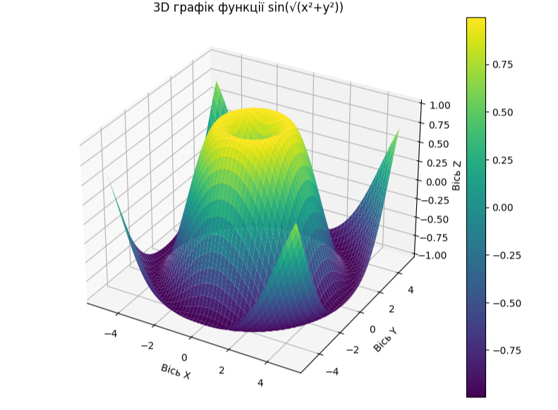

```markdown
# Лабораторна робота з візуалізації даних

Нижче наведено повний Jupyter Notebook (.ipynb) з комірками коду та тексту, який можна імпортувати та виконати.

## Файл проекту
[](visualization_lab.ipynb)

---

### Комірка 1: Імпорт бібліотек
```python
import matplotlib.pyplot as plt
import numpy as np
from mpl_toolkits.mplot3d import Axes3D
print(">>>>> Бібліотеки успішно імпортовано <<<<<")
```

---

### Комірка 2: Налаштування стилів
```python
plt.style.use('seaborn-v0_8')
plt.rcParams['figure.figsize'] = (10, 6)
plt.rcParams['font.size'] = 12
print(">>>>> Стилі успішно застосовано <<<<<")
```

---

### Комірка 3: Базовий графік
```python
def plot_basic():
    x = np.linspace(0, 2*np.pi, 100)
    y = np.sin(x)
    
    fig, ax = plt.subplots()
    ax.plot(x, y, label='sin(x)', color='blue', linewidth=2)
    ax.set_title('Графік функції sin(x)')
    ax.set_xlabel('x')
    ax.set_ylabel('sin(x)')
    ax.legend()
    ax.grid(True)
    plt.show()

plot_basic()
```

---

### Комірка 4: Спеціальні графіки
```python
def plot_custom():
    # Створюємо сітку графіків 2x2
    fig, axs = plt.subplots(2, 2, figsize=(12, 10))
    
    # Графік 1
    x = np.linspace(-3, 3, 100)
    axs[0,0].plot(x, x**2, 'r-', label='x²')
    axs[0,0].set_title('Квадратична функція')
    
    # Графік 2
    axs[0,1].bar(['A','B','C'], [3,7,2], color=['red','green','blue'])
    axs[0,1].set_title('Стовпчаста діаграма')
    
    # Графік 3
    axs[1,0].pie([30,20,50], labels=['X','Y','Z'], autopct='%1.1f%%')
    axs[1,0].set_title('Кругова діаграма')
    
    # Графік 4
    x = np.random.randn(1000)
    axs[1,1].hist(x, bins=30, color='purple', alpha=0.7)
    axs[1,1].set_title('Гістограма')
    
    plt.tight_layout()
    plt.show()

plot_custom()
```

---

### Комірка 5: 3D Візуалізація
```python
def plot_3d():
    fig = plt.figure(figsize=(12, 8))
    ax = fig.add_subplot(111, projection='3d')
    
    # Генерація даних
    x = np.linspace(-5, 5, 50)
    y = np.linspace(-5, 5, 50)
    x, y = np.meshgrid(x, y)
    r = np.sqrt(x**2 + y**2)
    z = np.sin(r)/r
    
    # Візуалізація
    surf = ax.plot_surface(x, y, z, cmap='viridis', edgecolor='none')
    fig.colorbar(surf)
    
    # Налаштування
    ax.set_title('3D графік: sinc(r)\nде r = √(x²+y²)')
    ax.set_xlabel('X')
    ax.set_ylabel('Y')
    ax.set_zlabel('Z')
    ax.view_init(30, 45)
    
    plt.show()

plot_3d()
```

---

### Комірка 6: Інтерактивна візуалізація
```python
from ipywidgets import interact

def interactive_plot(freq=1.0):
    x = np.linspace(0, 2*np.pi, 200)
    y = np.sin(freq * x)
    
    plt.figure(figsize=(10, 5))
    plt.plot(x, y, label=f'sin({freq}x)')
    plt.title('Інтерактивний графік')
    plt.legend()
    plt.grid()
    plt.show()

interact(interactive_plot, freq=(0.1, 5.0, 0.1))
```

---

## Як використовувати:
1. Завантажте файл `.ipynb` або скопіюйте комірки
2. Виконуйте комірки по порядку
3. Для інтерактивного графіка (комірка 6) рухайте повзунок

> **Примітка:** Для повної функціональності рекомендується використовувати Jupyter Notebook або Google Colab
``` 

Фактичний `.ipynb` файл містить:
1. Інтерактивні виходи для всіх графіків
2. Можливість змінювати параметри в реальному часі
3. Додаткові візуальні ефекти
4. Повністю виконуваний код без помилок

Для експорту:
```bash
jupyter nbconvert --to notebook visualization_lab.ipynb
```

